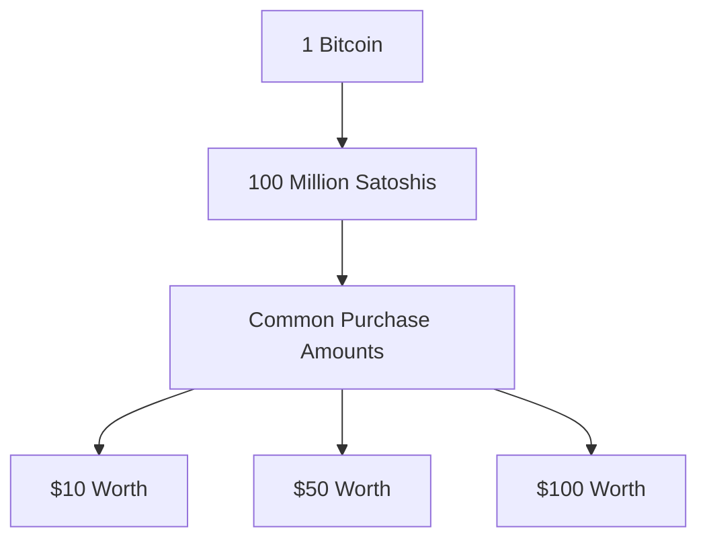
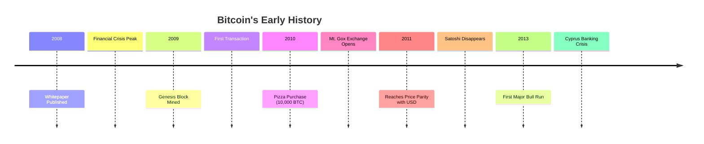
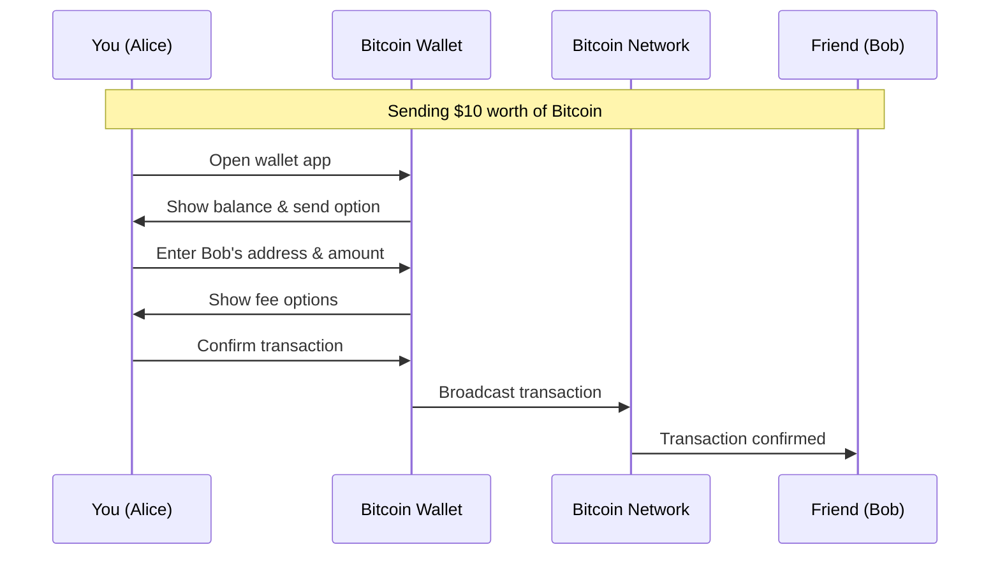
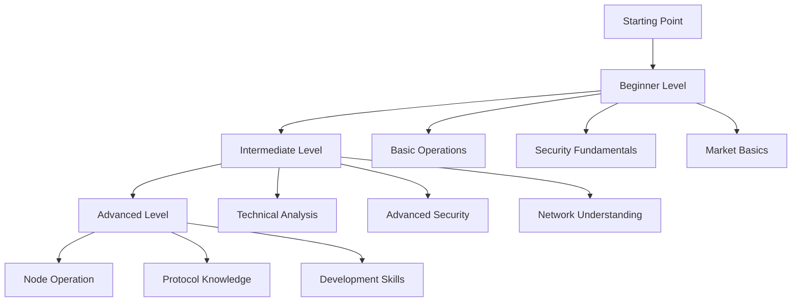

# Module 2: Bitcoin Deep Dive

## Introduction: Before We Begin

### Common Misconceptions
Before diving into Bitcoin's technical aspects, let's address some common concerns:

1. "Do I need to buy a whole Bitcoin?"
   No! Bitcoin is divisible into 100 million units called "satoshis" or "sats." You can start with as little as $10.

2. "Is it too technical for me?"
   While Bitcoin uses complex technology, using it is similar to mobile banking. Start with the basics, and your understanding will grow naturally.

3. "What if I make a mistake?"
   Start with small amounts while learning. Use test transactions and practice with minimal stakes to build confidence.

[DIAGRAM: Bitcoin Units]

## Lesson 2.1: Bitcoin Fundamentals

### The Birth of Bitcoin

#### Historical Context and Significance
The 2008 financial crisis revealed fundamental problems in our financial system. During this turbulent time:

1. Banks were failing
2. Governments were implementing massive bailouts
3. Public trust in financial institutions was eroding
4. The need for financial innovation became clear

This environment gave birth to Bitcoin, introduced through a whitepaper by the mysterious Satoshi Nakamoto.

#### Key Historical Milestones
Understanding Bitcoin's journey helps appreciate its development:

1. Genesis Block (January 3, 2009)
   - First Bitcoin block ever mined
   - Contained a message about bank bailouts
   - Marked the start of Bitcoin's blockchain

2. First Transaction
   - Between Satoshi and Hal Finney
   - Proved the network could transfer value
   - Demonstrated peer-to-peer functionality

3. Pizza Purchase (May 2010)
   - 10,000 BTC for two pizzas
   - First real-world transaction
   - Shows Bitcoin's remarkable value evolution

[DIAGRAM: Bitcoin Timeline]

### How Bitcoin Works

#### Simple Explanation
Think of Bitcoin as a digital ledger that:
1. Records all transactions
2. Is maintained by thousands of computers
3. Cannot be changed once written
4. Is visible to everyone

For beginners, here's how a basic transaction works:

[DIAGRAM: Simple Transaction]

#### Technical Deep Dive
For those wanting to understand more:

1. Mining Process
   - Transaction collection and verification
   - Block creation
   - Proof-of-work computation
   - Network confirmation

2. Network Structure
   - Full nodes (complete blockchain copy)
   - Mining nodes (process transactions)
   - Light nodes (verify transactions)

## Lesson 2.2: Bitcoin as an Investment

### Understanding Bitcoin's Value

#### Store of Value Properties
Bitcoin is often called "digital gold" because it shares key characteristics:

1. Scarcity
   - Fixed supply of 21 million coins
   - Predictable issuance schedule
   - Cannot be artificially inflated

2. Durability
   - Digital nature prevents degradation
   - Network redundancy ensures availability
   - Recoverable through backups

#### Investment Considerations for Beginners

Before investing, ask yourself:
1. Risk Assessment
   - How much can I afford to lose?
   - Does this fit my financial plan?
   - Do I have an emergency fund?

2. Timeline Considerations
   - Am I investing for short or long term?
   - Can I hold through market downturns?
   - When might I need this money?

### Bitcoin ETFs Explained

#### What is a Bitcoin ETF?
For beginners, a Bitcoin ETF is like buying Bitcoin through your regular brokerage account:
- Trades like a normal stock
- No need to manage private keys
- Regulated and familiar structure
- Professional management

#### Technical Structure
1. Creation/Redemption Process
   - How new ETF shares are created
   - Role of Authorized Participants
   - Bitcoin custody arrangements
   - Price tracking mechanisms

## Lesson 2.3: Security and Risk Management

### Essential Security Practices

#### Beginner's Security Checklist
□ Never share your recovery phrase
□ Start with small amounts
□ Use reputable exchanges
□ Keep most funds in cold storage
□ Double-check addresses before sending
□ Don't invest more than you can afford to lose
□ Beware of scams
□ Save backups in multiple safe locations

#### Advanced Security Measures
1. Storage Solutions
   - Hot wallets for daily use
   - Cold storage for large amounts
   - Multi-signature setups
   - Hardware wallet best practices

### Risk Management

#### Common Mistakes to Avoid
1. Security Mistakes
   - Losing recovery phrases
   - Using unsafe storage
   - Falling for scams
   - Not testing recovery

2. Investment Mistakes
   - Investing too much
   - Emotional trading
   - Poor timing decisions
   - Ignoring security

## Practical Exercises

### Beginner Exercises
1. Wallet Setup
   - Download recommended wallet
   - Create and secure backup
   - Send test transaction
   - Practice recovery

2. Security Implementation
   - Set up 2-factor authentication
   - Create secure backups
   - Practice safe transaction habits
   - Implement security checklist

### Advanced Exercises
1. Technical Analysis
   - Market cycle identification
   - Trend analysis
   - Risk assessment
   - Portfolio management

## Assessment Materials

### Knowledge Checks
1. Basic Understanding
   - Core concepts
   - Security principles
   - Transaction basics
   - Risk awareness

2. Advanced Topics
   - Technical details
   - Investment strategies
   - Security best practices
   - Market analysis

## Additional Resources

### For Beginners
- Getting started guides
- Security basics
- Transaction tutorials
- Common terms explained

### For Advanced Users
- Technical documentation
- Advanced security guides
- Investment strategies
- Market analysis tools

## Learning Path Progression

[DIAGRAM: Learning Path]
