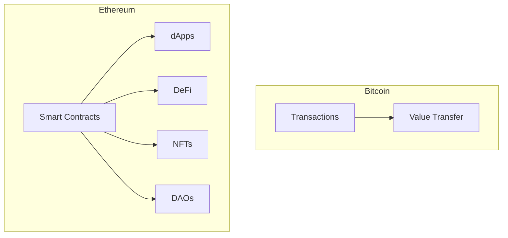
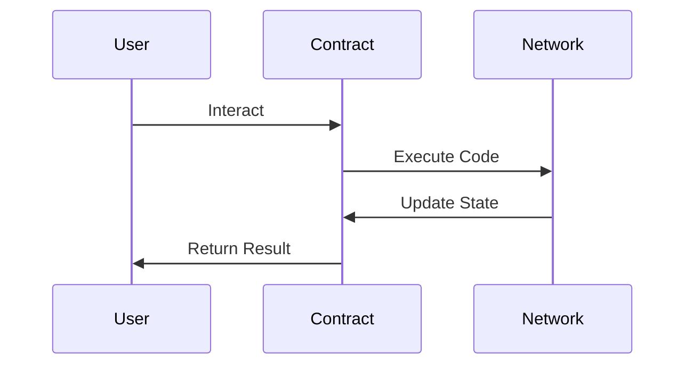
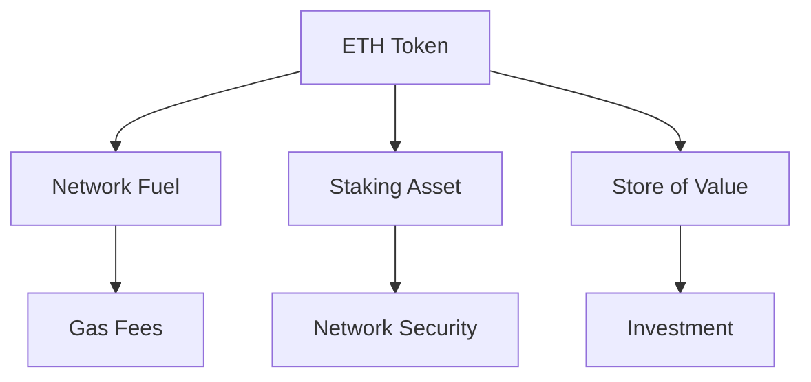

# Module 3: Comprehensive Ethereum Guide

## Introduction: Understanding Ethereum

### What Makes Ethereum Different?

Unlike Bitcoin's primary focus on monetary transactions, Ethereum represents a fundamental shift in blockchain technology. It serves as a global, decentralized computing platform that can run applications and handle complex financial interactions.

#### Programmable Blockchain Platform
Ethereum's key innovation lies in its programmability. While Bitcoin excels at being digital money, Ethereum acts as a complete computational platform:

1. Decentralized Applications (dApps)
   These are applications that run on the blockchain rather than centralized servers. Unlike traditional apps that might go down with a single server failure, dApps continue running as long as the Ethereum network exists. Examples include:
   - Decentralized trading platforms
   - Lending and borrowing protocols
   - Gaming applications
   - Social media platforms
   - Digital art marketplaces

2. Smart Contract Capabilities
   Smart contracts are self-executing programs that automatically enforce agreements. They enable:
   - Automated loan processing
   - Instant trade settlement
   - Transparent voting systems
   - Programmable money flows
   - Trust-minimized agreements

3. Digital Asset Creation
   Ethereum allows anyone to create digital assets, including:
   - Fungible tokens (like ERC-20)
   - Non-fungible tokens (NFTs)
   - Hybrid token systems
   - Synthetic assets
   - Tokenized real-world assets

[DIAGRAM: Ethereum vs Bitcoin]

## Lesson 3.1: Ethereum Fundamentals

### The Ethereum Platform

#### Smart Contracts: The Building Blocks
Smart contracts represent a revolutionary way to create and enforce agreements. They are:

1. Self-Executing Programs
   Smart contracts run exactly as programmed without:
   - Need for intermediaries
   - Possibility of downtime
   - Risk of fraudulent interference
   - Manual intervention requirements

2. Code-Based Rules
   Smart contracts enforce rules through:
   - Immutable code logic
   - Transparent execution
   - Verifiable outcomes
   - Automated enforcement

3. Real-World Applications
   Smart contracts enable numerous applications:
   
   a) Financial Services
      - Automated lending protocols
      - Decentralized exchanges
      - Insurance products
      - Payment systems
   
   b) Digital Rights Management
      - Content licensing
      - Royalty distribution
      - Access control
      - Usage tracking
   
   c) Supply Chain Management
      - Product tracking
      - Authenticity verification
      - Payment automation
      - Document management

[DIAGRAM: Smart Contract Flow]

### The Ethereum Virtual Machine (EVM)

#### Understanding the EVM
The Ethereum Virtual Machine is the engine that powers all Ethereum operations. Think of it as a global computer that:

1. Execution Environment
   The EVM provides:
   - Consistent execution across all nodes
   - Deterministic operation
   - Secure code isolation
   - Resource management
   - State maintenance

2. Gas System
   Ethereum's computational pricing mechanism:
   
   a) Gas Costs
      - Each operation has a specific gas cost
      - More complex operations cost more gas
      - Prevents infinite loops and spam
      - Ensures fair resource usage
   
   b) Gas Pricing
      - Users bid for block space
      - Higher gas prices mean faster inclusion
      - Dynamic pricing based on network demand
      - Gas optimization opportunities

### Decentralized Applications (dApps)

#### The dApp Ecosystem
Decentralized applications represent a new paradigm in software development:

1. Architecture
   dApps consist of:
   - Frontend user interface
   - Backend smart contracts
   - Decentralized storage
   - Blockchain integration
   
   Each component works together to create trustless applications that:
   - Cannot be shut down
   - Run without central control
   - Maintain user privacy
   - Operate transparently

2. Popular Categories
   The dApp ecosystem includes:
   
   a) Financial Services (DeFi)
      - Lending platforms
      - Trading protocols
      - Insurance services
      - Asset management
   
   b) Gaming and Entertainment
      - Blockchain games
      - Collectible platforms
      - Virtual worlds
      - Content platforms
   
   c) Infrastructure
      - Identity systems
      - Storage solutions
      - Oracle networks
      - Layer 2 scaling

## Lesson 3.2: Investment and Value Proposition

### Understanding Ethereum's Value

#### Network Effects and Utility
Ethereum's value derives from its utility and network effects:

1. Developer Ecosystem
   Ethereum benefits from:
   - Largest developer community in blockchain
   - Extensive tooling and documentation
   - Regular protocol improvements
   - Active research and development
   
   This creates a virtuous cycle where:
   - More developers build better tools
   - Better tools attract more developers
   - More applications attract users
   - More users attract developers

2. Economic Model
   Ethereum's economics include:
   
   a) Supply Mechanics
      - Proof of Stake rewards
      - EIP-1559 fee burning
      - Reduced issuance
      - Deflationary potential
   
   b) Staking Economics
      - Validator rewards
      - Network security
      - Participation incentives
      - Yield opportunities

[DIAGRAM: Ethereum Economy]

## Security and Risk Considerations

### Smart Contract Security

#### Understanding Risks
Smart contract interactions carry unique risks:

1. Technical Vulnerabilities
   Potential issues include:
   - Code bugs and exploits
   - Logic flaws
   - Integration failures
   - Upgrade risks
   
   Prevention requires:
   - Thorough auditing
   - Formal verification
   - Extensive testing
   - Gradual deployment

2. Economic Attack Vectors
   Smart contracts face:
   - Flash loan attacks
   - Price manipulation
   - Front-running
   - Governance attacks
   
   Protection involves:
   - Economic design review
   - Attack vector analysis
   - Security best practices
   - Monitoring systems

### Risk Management Practices

#### Personal Security
Protecting your Ethereum assets requires:

1. Wallet Security
   Essential practices:
   - Hardware wallet usage
   - Regular security audits
   - Backup procedures
   - Emergency planning
   
   Implementation includes:
   - Multiple device backups
   - Physical security measures
   - Access control systems
   - Recovery procedures

2. Transaction Safety
   Safe operation requires:
   - Address verification
   - Gas price checking
   - Contract validation
   - Amount confirmation
   
   Best practices include:
   - Test transactions
   - Security tools usage
   - Regular updates
   - Education and training

[Continue with Practical Exercises and Assessments sections? Let me know if you'd like me to expand any particular area further.]