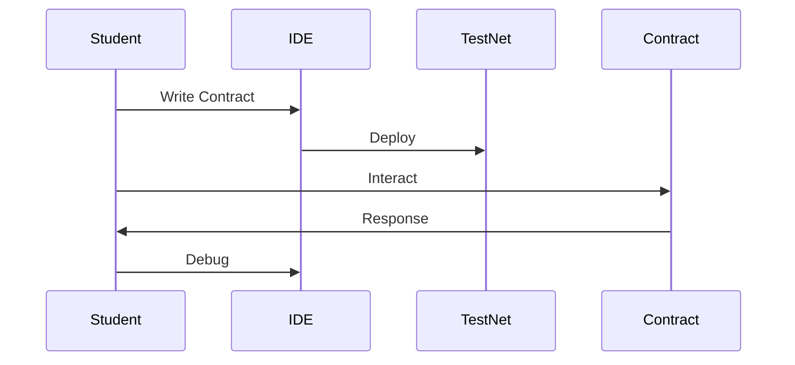
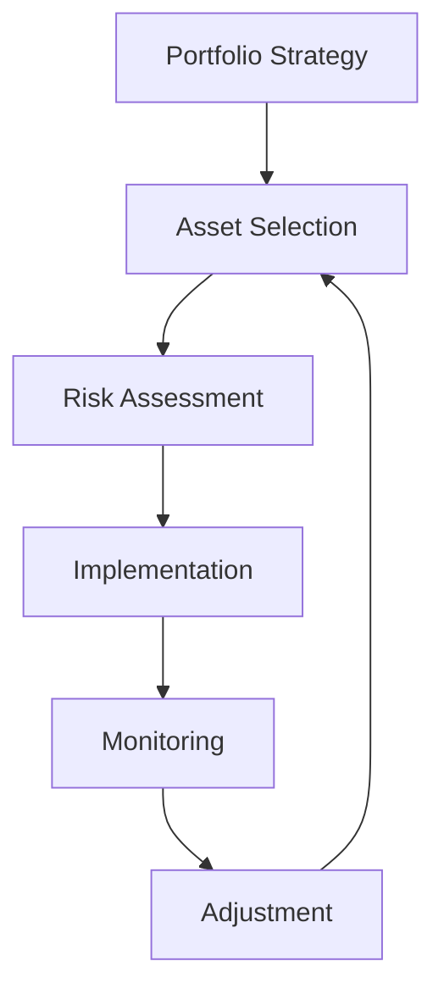
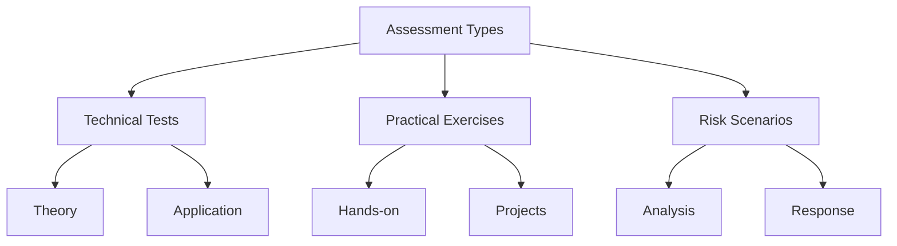

# Practical Exercises and Assessments

## Hands-On Learning Exercises

### Exercise 1: Ethereum Wallet Setup and Security

#### Basic Wallet Operations
Step-by-step practice with:

1. Wallet Creation and Management
   a) Setting Up MetaMask
      - Install MetaMask extension
      - Create new wallet
      - Secure recovery phrase
      - Configure security settings
   
   b) Network Configuration
      - Add test networks
      - Switch between networks
      - Understand gas settings
      - Manage network connections

2. Security Implementation
   a) Basic Security Setup
      - Enable password protection
      - Implement 2FA where available
      - Create secure backups
      - Test recovery procedures
   
   b) Advanced Security Features
      - Hardware wallet integration
      - Address book management
      - Transaction signing practice
      - Security audit checklist

### Exercise 2: Smart Contract Interaction

#### Interacting with Test Contracts
Practice using Ethereum's features:

1. Contract Deployment
   a) Using Remix IDE
      - Write simple contract
      - Compile contract
      - Deploy to test network
      - Verify deployment
   
   b) Contract Interaction
      - Call contract functions
      - Send transactions
      - Monitor events
      - Debug issues

2. DeFi Protocol Practice
   a) Basic Operations
      - Connect to protocols
      - Approve token spending
      - Execute swaps
      - Provide liquidity
   
   b) Advanced Operations
      - Yield farming
      - Lending/borrowing
      - Portfolio management
      - Risk monitoring

[DIAGRAM: Smart Contract Exercise Flow]

### Exercise 3: Network Analysis and Monitoring

#### Understanding Network Metrics
Learn to analyze Ethereum network data:

1. Block Explorer Usage
   a) Transaction Analysis
      - Track transactions
      - Analyze gas costs
      - Monitor confirmations
      - Review contract interactions
   
   b) Address Monitoring
      - Track balances
      - Review transaction history
      - Monitor token transfers
      - Analyze smart contract activity

2. Network Statistics
   a) Performance Metrics
      - Gas price trends
      - Network congestion
      - Transaction volumes
      - Protocol usage

## Advanced Practical Projects

### Project 1: DeFi Portfolio Management

#### Building a DeFi Strategy
Develop and implement a DeFi portfolio:

1. Portfolio Setup
   a) Asset Selection
      - Research protocols
      - Assess risks
      - Calculate potential yields
      - Plan allocations
   
   b) Implementation
      - Execute positions
      - Monitor performance
      - Adjust strategies
      - Manage risks

2. Performance Tracking
   a) Metrics Monitoring
      - Track returns
      - Calculate impermanent loss
      - Monitor gas costs
      - Assess risk metrics

[DIAGRAM: Portfolio Management Flow]

### Project 2: Smart Contract Analysis

#### Contract Security Review
Learn to analyze smart contracts:

1. Code Review Process
   a) Basic Analysis
      - Read contract code
      - Identify functions
      - Understand logic flow
      - Spot potential issues
   
   b) Security Assessment
      - Check for common vulnerabilities
      - Review access controls
      - Analyze economic model
      - Test edge cases

2. Documentation Practice
   a) Technical Documentation
      - Document findings
      - Create flow diagrams
      - Write risk assessments
      - Propose improvements

## Assessment Materials

### Knowledge Verification

#### Comprehensive Testing
Multiple assessment types:

1. Technical Understanding
   a) Written Assessments
      - Multiple choice questions
      - Short answer problems
      - Case study analysis
      - Code review exercises
   
   b) Practical Tests
      - Contract deployment
      - Transaction execution
      - Problem-solving scenarios
      - Security audits

2. Risk Management
   a) Scenario Analysis
      - Market events
      - Technical failures
      - Security incidents
      - Recovery procedures

[DIAGRAM: Assessment Framework]

### Project Evaluation

#### Performance Metrics
Evaluating practical work:

1. Technical Competency
   a) Code Quality
      - Functionality
      - Security
      - Efficiency
      - Documentation
   
   b) Problem Solving
      - Approach
      - Implementation
      - Debugging
      - Optimization

2. Risk Understanding
   a) Security Practices
      - Risk identification
      - Mitigation strategies
      - Emergency procedures
      - Best practices implementation

## Additional Learning Resources

### Technical Documentation
Comprehensive resources:

1. Development Resources
   a) Code Examples
      - Basic contracts
      - DeFi protocols
      - Security patterns
      - Testing frameworks
   
   b) Tutorial Materials
      - Step-by-step guides
      - Video tutorials
      - Interactive exercises
      - Code workshops

2. Security Guidelines
   a) Best Practices
      - Contract development
      - Security auditing
      - Risk management
      - Emergency response

[Continued in next section...]