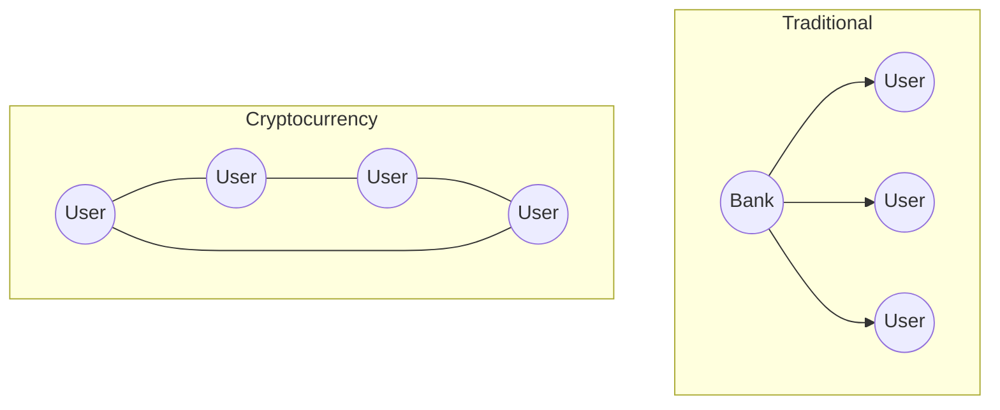

# Module 1: Cryptocurrency Basics - Detailed Explanations

## Understanding Digital Money vs Traditional Money

### 1. Physical Cash vs Digital Currency
Let's understand what makes cryptocurrency different from the money in your wallet.

**Traditional Physical Cash:**
Think about the $20 bill in your wallet. You can:
- Hold it in your hand
- Give it directly to someone else
- Use it without electricity or internet
- Lose it permanently if destroyed
- Only use it in its country of origin (mostly)

However, physical cash has limitations:
- Can be lost or stolen
- Degrades over time
- Expensive to transport in large amounts
- Must be physically present to use
- Can be counterfeited

**Cryptocurrency Difference:**
Now, imagine your cryptocurrency. It:
- Exists as computer code
- Can't be physically destroyed
- Can be backed up
- Works anywhere with internet
- Can't be counterfeited
- Can be sent globally instantly

Real-World Example:
"Imagine sending $1,000 to family overseas. With cash, you'd need to:
1. Physically go to a bank
2. Convert to another currency
3. Pay high fees
4. Wait days for delivery

With cryptocurrency:
1. Open your phone
2. Send to their wallet address
3. Pay minimal fees
4. Arrives in minutes"

### 2. Bank Digital Money vs Cryptocurrency
Let's compare your bank account to cryptocurrency.

**Traditional Bank Account:**
Your bank account shows:
- Numbers on a screen
- Controlled by the bank
- Subject to bank rules
- Limited by bank hours
- Can be frozen or restricted

Example: "When you check your bank balance, you're actually looking at an IOU from the bank. The bank controls:
- When you can send money
- How much you can send
- Where you can send it
- What fees you'll pay"

**Cryptocurrency Reality:**
With cryptocurrency:
- You control your money directly
- No bank permission needed
- Send any amount, anytime
- Works 24/7/365
- Can't be frozen by others

Practical Scenario:
"It's 3 AM Sunday, and you need to send $5,000 urgently:
- Bank: Wait until Monday morning
- Cryptocurrency: Send immediately"

### 3. Security Features

**Traditional Banking Security:**
Your bank account relies on:
- Username/password
- Maybe 2-factor authentication
- Bank's security systems
- Insurance against theft
- Customer service for issues

**Cryptocurrency Security:**
Cryptocurrency uses:
- Mathematical proof (cryptography)
- Private keys (like a mathematical signature)
- Decentralized verification
- Immutable transaction record
- Self-custody options

Think of it like this:
"Bank security is like having guards at a vault. Cryptocurrency security is like having a mathematical puzzle that's impossible to solve without the right key."

### 4. The Double-Spending Problem

**The Challenge:**
Imagine copying and pasting a digital dollar - that's the double-spending problem.

**Traditional Solution:**
Banks prevent this by:
- Keeping a central ledger
- Tracking all transactions
- Updating balances
- Requiring trust in the bank

**Cryptocurrency Solution:**
Bitcoin solved this through:
- Public transaction record (blockchain)
- Network verification (nodes)
- Mathematical proof (mining)
- Consensus rules

Real Example:
"When you spend cryptocurrency, the entire network:
1. Sees your transaction
2. Verifies you haven't spent it before
3. Confirms it's legitimate
4. Records it permanently"

### 5. Financial Inclusion

**Current Banking Problems:**
Many people can't access banks because:
- No nearby banks
- Minimum balance requirements
- Required documentation
- Poor credit history
- High fees

**Cryptocurrency Solution:**
Anyone can use cryptocurrency with:
- Just a smartphone
- Internet connection
- No minimum amounts
- No credit checks
- No bank approval

Case Study:
"Consider a farmer in a rural area:
- No banks within 50 miles
- Can't maintain minimum balance
- Needs to send/receive payments

With cryptocurrency:
- Uses phone wallet
- Receives payments instantly
- Stores value safely
- Trades globally"

### 6. Payment Efficiency

**Traditional Payment Issues:**
Current payment systems:
- Take days to settle
- Charge high fees
- Only work during business hours
- Require multiple intermediaries
- Have country restrictions

**Cryptocurrency Advantages:**
Cryptocurrency payments:
- Settle in minutes
- Cost very little
- Work 24/7
- Go directly peer-to-peer
- Work globally

Cost Comparison:
"Sending $1,000 internationally:
- Bank wire: $45 fee, 3-5 days
- Credit card: Not possible directly
- Cryptocurrency: $1 fee, 10 minutes"

### 7. Digital Scarcity

**Traditional Digital Problems:**
Digital items usually can be:
- Copied infinitely
- Created at will
- Modified easily
- Duplicated perfectly

**Cryptocurrency Innovation:**
Bitcoin and other cryptocurrencies:
- Have fixed supply
- Can't be copied
- Are verifiably scarce
- Follow strict rules

Example:
"Bitcoin has a maximum of 21 million coins ever. Like land on Earth, they can't make more. This creates digital scarcity similar to physical gold."

### 8. Decentralization

**Traditional Centralization:**
Current financial systems are centralized:
- Banks control money flow
- Governments control banks
- Single points of failure
- Hierarchical control

**Cryptocurrency Decentralization:**
Cryptocurrency networks are distributed:
- No central control
- Network consensus rules
- Multiple redundant nodes
- Community governance

Visualization:
"Think of traditional banking as a star pattern - everything connects to the center. Cryptocurrency is like a spider web - connected everywhere with no center."

[DIAGRAM: Network Comparison]

### 9. Practical Control

**Traditional Banking Control:**
Your money is controlled by:
- Bank policies
- Government regulations
- Account restrictions
- Operating hours
- Service availability

**Cryptocurrency Control:**
You control your cryptocurrency through:
- Private keys
- Personal wallet
- Direct transactions
- Network rules
- Self-custody

Real Scenario:
"During a banking crisis, banks can:
- Limit withdrawals
- Close temporarily
- Freeze accounts

With cryptocurrency:
- You always have access
- No withdrawal limits
- Can't be frozen
- Works even during crises"

### 10. Network Security

**Traditional Security:**
Bank security depends on:
- Central servers
- Employee trustworthiness
- Corporate policies
- Physical security
- Insurance

**Cryptocurrency Security:**
Network security comes from:
- Mathematical proofs
- Distributed nodes
- Consensus rules
- Open-source code
- Economic incentives

Example:
"To hack a bank, attackers need to breach one system. To hack Bitcoin, they'd need to hack thousands of computers simultaneously while solving impossible math problems."

## Practice Activities

For each concept, try:
1. Explaining it to a friend
2. Finding real-world examples
3. Testing it with small amounts
4. Documenting your understanding
5. Participating in discussions

Remember:
- Start small
- Ask questions
- Practice safely
- Learn continuously
- Stay updated