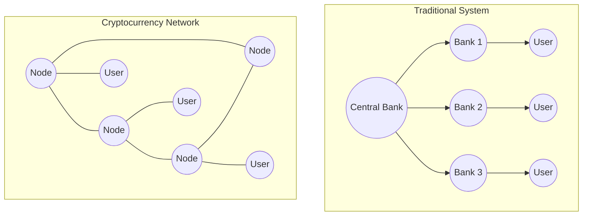
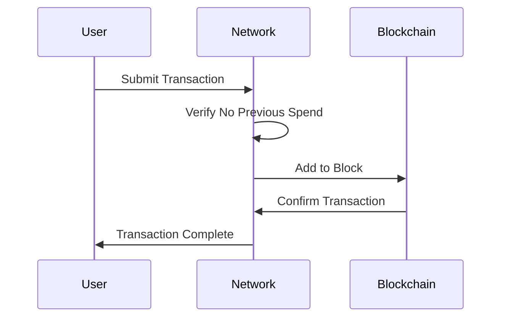

# Module 1: Understanding Cryptocurrency - A Comprehensive Guide

## Introduction to Digital Currency

In today's rapidly evolving financial landscape, cryptocurrency represents a revolutionary approach to money and value transfer. Before diving into specific cryptocurrencies or technical details, it's essential to understand what makes digital currencies unique and how they differ from traditional money systems.

### Understanding Traditional Money vs. Cryptocurrency

Think about the cash in your wallet or the money in your bank account. Traditional money exists in two main forms: physical cash and digital bank balances. Physical cash offers immediate, tangible transactions but comes with limitations like physical degradation, security risks, and geographical restrictions. Digital bank money, while more convenient for many transactions, relies entirely on banks and financial institutions as intermediaries.

Cryptocurrency introduces a fundamentally different approach. It exists purely as digital information, but unlike the numbers in your bank account, it doesn't represent a claim on a bank or institution. Instead, cryptocurrency operates through a decentralized network of computers, using advanced cryptography to ensure security and verify transactions.

### The Evolution of Money

To understand cryptocurrency's significance, consider how money has evolved:

1. Barter systems required direct exchange of goods
2. Precious metals provided portable, divisible value
3. Paper money offered convenient value representation
4. Digital banking enabled electronic transfers
5. Cryptocurrency introduces programmable, borderless money

Each evolution solved previous limitations while introducing new capabilities. Cryptocurrency represents the latest step in this evolution, addressing many traditional financial system limitations while introducing new considerations and risks.

## Core Concepts and Features

### Decentralization: A New Paradigm

One of cryptocurrency's most revolutionary aspects is its decentralized nature. Traditional financial systems operate through centralized authorities – banks, governments, and financial institutions. These entities control money creation, verify transactions, and maintain account balances.

Cryptocurrency works differently. Instead of relying on central authorities, it uses a network of computers running specialized software. This network collectively maintains and verifies all transactions through a system called blockchain. Think of it as a shared digital ledger that everyone can see but no one can alter without network consensus.

[DIAGRAM: Decentralization Comparison]

### Digital Scarcity: A Breakthrough Innovation

Before cryptocurrency, creating genuine scarcity in digital assets seemed impossible. Digital files could be copied infinitely without degradation. Bitcoin solved this through its blockchain technology and precise supply controls. For example, Bitcoin has a fixed maximum supply of 21 million coins, with a predetermined release schedule that can't be altered without network consensus.

This digital scarcity creates value similarly to how limited resources like gold or fine art maintain value. Unlike traditional currency, which central banks can print at will, cryptocurrency supply is often mathematically guaranteed and transparent.

## Understanding Cryptocurrency Security

### Cryptographic Foundations

Cryptocurrency security relies on advanced cryptography, specifically public-key cryptography. This system uses pairs of keys:
- A private key (like your secret password)
- A public key (like your public email address)

The private key generates valid signatures for transactions, while the public key allows others to verify these signatures. This system creates a secure, mathematically verified way to prove ownership and authorize transactions without requiring trust in third parties.

### The Double-Spending Solution

One of cryptocurrency's most significant achievements is solving the "double-spending" problem for digital money. In traditional digital systems, preventing someone from copying and reusing digital money required central authorities to track all transactions. Cryptocurrency solves this through its blockchain and network consensus mechanism.

[DIAGRAM: Double-Spend Prevention]

## Risk Considerations and Management

### Market Volatility

Cryptocurrency prices can experience significant volatility, often more extreme than traditional assets. Daily price swings of 10% or more are not uncommon, and historical data shows periods of both dramatic increases and severe decreases in value.

Key volatility considerations include:
- Market sentiment impacts
- Regulatory news effects
- Technology development influence
- Market manipulation risks

### Security Risks

While cryptocurrency's cryptographic foundation is secure, various security risks exist in practical usage:

1. Personal Security Risks:
   - Private key loss or theft
   - Phishing attacks
   - Social engineering attempts
   - Malware threats

2. Technical Risks:
   - Software vulnerabilities
   - Network attacks
   - Smart contract exploits
   - Exchange security breaches

### Storage and Access Security

Proper cryptocurrency storage is crucial for security. Options include:

1. Hot Wallets (Online):
   - Mobile applications
   - Desktop software
   - Web-based services
   Suitable for small amounts and frequent transactions

2. Cold Storage (Offline):
   - Hardware wallets
   - Paper wallets
   - Air-gapped computers
   Recommended for larger holdings and long-term storage

## Practical Applications

### Financial Inclusion

Cryptocurrency provides financial services access to previously underserved populations:
- People without bank accounts
- Residents of countries with unstable currencies
- Individuals with limited access to traditional banking
- International workers needing to send remittances

### Payment Efficiency

Cryptocurrency offers several advantages for payments:
- Near-instant transfers globally
- Lower transaction fees
- 24/7 operation
- No intermediary requirements
- Programmable payment options

### Investment Opportunities and Risks

When considering cryptocurrency as an investment:

1. Potential Benefits:
   - Portfolio diversification
   - Technology exposure
   - Potential high returns
   - Inflation hedge properties

2. Risk Factors:
   - High volatility
   - Regulatory uncertainty
   - Technical complexity
   - Market manipulation risks

## Getting Started Safely

### First Steps

1. Education First:
   - Understand basic concepts
   - Learn security principles
   - Study market dynamics
   - Review risk factors

2. Start Small:
   - Use small amounts initially
   - Practice with test networks
   - Learn wallet management
   - Understand transaction processes

### Security Best Practices

1. Essential Security Measures:
   - Use strong passwords
   - Enable two-factor authentication
   - Maintain secure backups
   - Keep software updated
   - Verify all transactions

2. Advanced Protection:
   - Hardware wallet usage
   - Multi-signature setups
   - Cold storage implementation
   - Regular security audits

## Conclusion and Next Steps

Understanding cryptocurrency requires balancing its revolutionary potential with practical risks and limitations. As you continue learning, remember:
- Start with fundamentals before advancing
- Prioritize security in all activities
- Stay informed about developments
- Practice with small amounts first
- Maintain proper risk management

The cryptocurrency space continues evolving, making ongoing education essential for safe and effective participation.